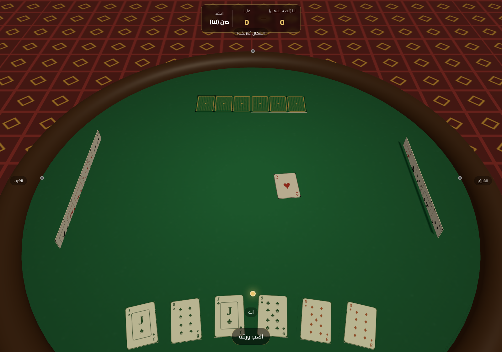

# بلوت 3D — Baloot 3D

A browser-based 3D version of **Baloot** (بلوت), the classic Gulf trick-taking card
game, built with [Three.js](https://threejs.org/). You partner with the North player
against East and West; first team to **152** points wins.



## Features

- Full 3D majlis table, lighting, shadows, and animated card dealing/playing.
- Procedurally drawn 32-card Baloot deck (canvas textures — no image assets).
- **Sun (صن)** and **Hokom (حكم)** contracts with correct card ordering and point values.
- Two-round bidding with a fully playable human bidder + heuristic AI for the 3 bots.
- Faithful follow-suit / over-trump rules, trick resolution, last-trick bonus (أرض),
  and "qahwa" (declarer-goes-down) scoring.
- Arabic, right-to-left UI.

## Run it

It's a static site — just serve the folder over HTTP (ES modules need a server):

```bash
cd baloot-3d
python3 -m http.server 8123
# open http://localhost:8123
```

Then click **ابدأ اللعب** to start. Click a highlighted card to play it.

## Layout

| File | Purpose |
|------|---------|
| `index.html` | Page shell, RTL Arabic HUD, styling. |
| `js/scene.js` | Three.js renderer, camera, lights, table. |
| `js/cards.js` | Canvas-drawn card faces/back + 3D card meshes. |
| `js/baloot.js` | Pure game rules: deck, legal moves, ordering, scoring. |
| `js/ai.js` | Heuristic bidding + card-play AI. |
| `js/main.js` | Game loop, animation/tweening, input, UI wiring. |
| `vendor/three.module.js` | Vendored Three.js r160 (offline, no CDN). |

## Rules summary

- 4 players in 2 partnerships (You + North vs. East + West), 32 cards (7–A).
- Each hand: deal 5, flip a card, bid **Hokom** (trump = flipped suit) or **Sun** (no trump)
  or pass. Second round lets you choose any trump. Then deal up to 8 cards each.
- **Hokom order:** J(20) 9(14) A(11) 10(10) K(4) Q(3) 8 7 for the trump suit;
  plain order for the rest.
- **Sun order:** A(11) 10(10) K(4) Q(3) J(2) 9 8 7 in every suit.
- The declaring team must take more than half the points, or all points go to the
  defenders (qahwa). Last trick is worth +10.
